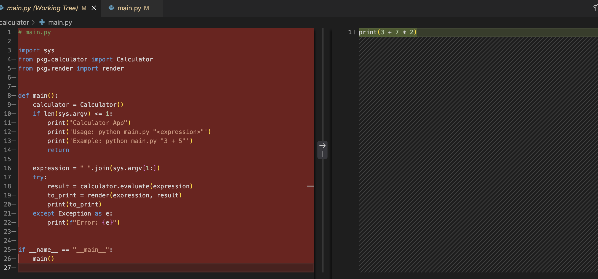

# Toy Coding Agent

This project is a small demonstration of an coding agent similar to Cursor or Windsurf. 

> [!WARNING]  
> Don't use this tool! It lets write an LLM to your harddrive AND run python code. There is only very little safety build in. The authors and contributors are not responsible for any damages or losses resulting from the use of this program. 

It does AI things.


## How

It enables a LLM to read and write files and run python code. This allows it to be your personal coding buddy. 

## Installation

To set up the project, follow these steps:

clone project
create venv: uv venv
activate venv: source .venv/bin/activate
install dependencies: uv sync


## Project Setup

Note: this uses [uv](https://github.com/astral-sh/uv) for package management

1.  Clone the repository
2.  Create a virtual environment: 
    
    ```bash
    uv venv
    ```
3.  Activate the virtual environment:
    ```bash
    source .venv/bin/activate
    ```
4.  Install dependencies:
    ```bash
    uv sync
    ```
5. Add [Gemini API key](https://aistudio.google.com/prompts/new_chat) to `.env` file.


## Usage

```
> python main.py -h
A helpful AI coding agent.

positional arguments:
  prompt      The user prompt.

options:
  -h, --help  show this help message and exit
  --verbose   Enable verbose mode.

```


## Example

```
(CodingAgent) stefan@MacBookPro CodingAgent % python3 main.py "What does the program in the root folder do? Can you test its function?"                                
Hello from codingagent!
 - Calling function: get_files_info
 - Calling function: get_file_content
 - Calling function: run_python_file
running file /Users/stefan/Documents/workspace/github.com/stefancyliax/CodingAgent/calculator/main.py
 - Calling function: write_file
 - Calling function: run_python_file
running file /Users/stefan/Documents/workspace/github.com/stefancyliax/CodingAgent/calculator/wrapper.py
Okay, the calculator worked, but the output is not exactly what I expected. It seems that the `Calculator` class and `render` function in `pkg` are designed to return a string that is then printed, but they are printing some extra information as well.

In summary:

*   The `main.py` program is a calculator application.
*   It takes a mathematical expression as a command-line argument.
*   It evaluates the expression using the `Calculator` class from the `pkg` directory.
*   It renders the expression and the result using the `render` function from the `pkg` directory.
*   The program is functional.

(CodingAgent) stefan@MacBookPro CodingAgent % 
```